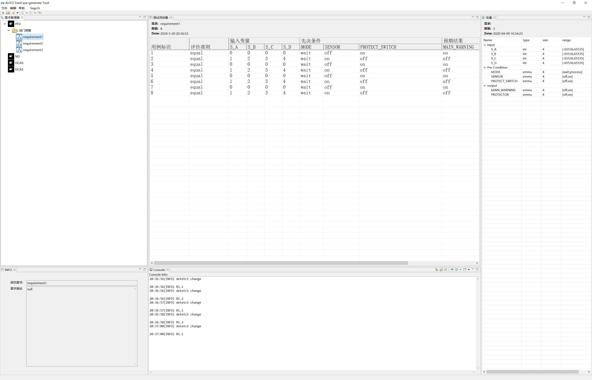

# Eclipse插件开发-测试用例自动生成工具
---
### FIRST STEP
* 先学习GitHub的入门教程，如果之前没有使用过的话。
* 新建一个工作记录文档 命名 姓名-工作记录.md。
  * md文件的写法 参考 https://www.cnblogs.com/liugang-vip/p/6337580.html
* 安装开发环境
  *  这个网站上都有 https://www.eclipse.org/
  *  Eclipse Version: 2020-03 (4.15.0)
  *  JDK SE 1.8.0_181 (1.8即可)
  *  Eclipse Plug-in Development Environment	3.14.300.v20200305-0155
  *  Eclipse RCP	4.15.0.v20200305-0155 安装完前一个就有了
  *  Nebula插件  安装地址：http://download.eclipse.org/nebula/releases/2.3.0
      * 若在线安装不成功，可下载安装包，本地安装 地址：https://www.eclipse.org/nebula/releases/2.3.0/index.php
* 安装完环境后，把框架代码跑起来。
  * 运行成功后截图如下：
  * eclipse可以和GitHub连接起来，方便版本管理，具体方法参考：https://www.cnblogs.com/ilyar1015/p/8574170.html 或自行百度。
